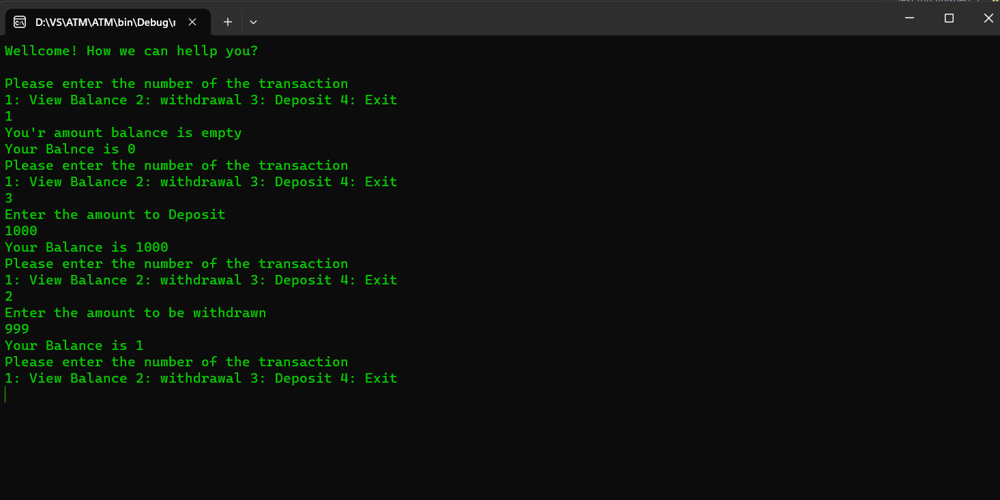

# Lab02-ATM

## What is this program?
- This program simulates the way ATM works and contains basic processes such as deposit, withdrawal, and account detection, and messages were made to appear to the customer according to the process he wanted, and if the process he wanted to do is correct or if is there something wrong.

## What it looks like in action :

## How to use it :
- First thing you will see a Welcome message and instructions to follow.
- 
***Wellcome! How we can hellp you?***

***Please enter the number of the transaction***

***1: View Balance 2: WithDrawal 3: Deposit 4: Exit***

- If you want check the balance you can type 1, and the balance amounte will appear.
- If you want to WithDrawal you can type 2 and after that enter the amounte you want to WithDrawal.
- If you want to Deposit you can type 3 and after that enter the amounte you want to Deposit.
- If you want to Exit you can type 4.